This list is not frequently updated. Please see my [Google Scholar](https://scholar.google.com/citations?user=eMW6EsoAAAAJ&hl=zh-CN) for the full record and recent update. (*Corresponding Author, =Equal Contributions.)

## Preprint/Submitted Manuscript

***Collaborative imputation of urban time series through cross-city meta-learning***, **Tong Nie**, Wei Ma\*, Jian Sun\*, Yu Yang, Jiannong Cao. *Arxiv Preprint* / *ICLR Workshop on Weight Space Learning* / Under 2nd Round Review at IEEE TKDE, 2025. | [[Paper](https://doi.org/10.48550/arXiv.2501.11306)] | 

  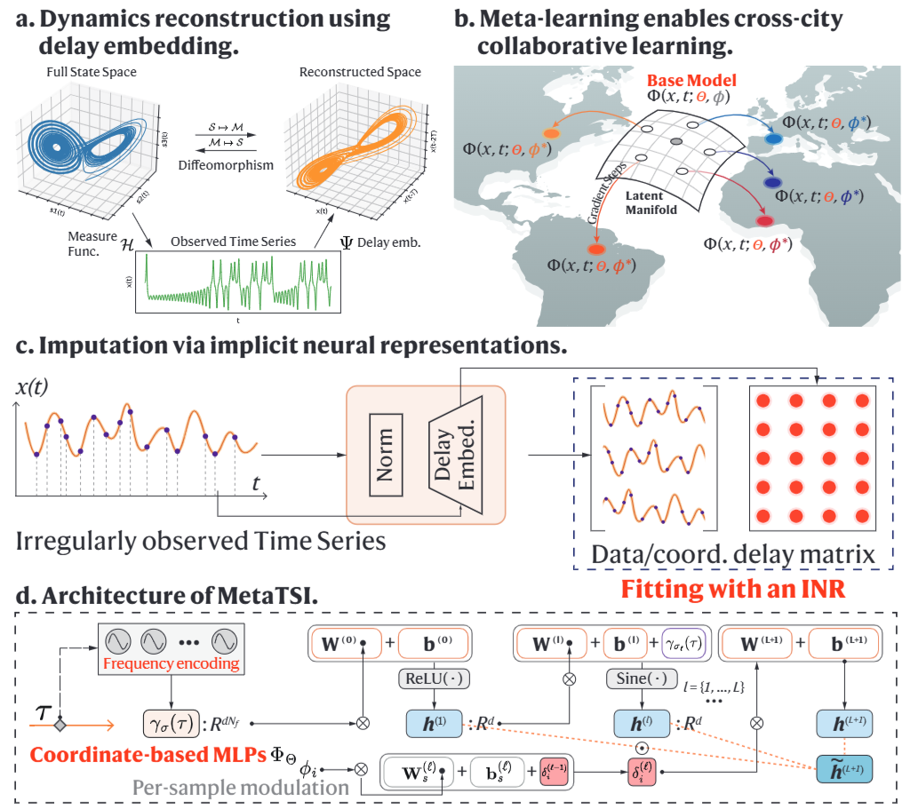
  
  *TL;DR*: We introduce a cross-city collaborative time series imputation method based on meta learning implicit neural representations.

## Journal Publications

***Exploring the Roles of Large Language Models in Reshaping Transportation Systems: A Survey, Framework, and Roadmap***, **Tong Nie**, Jian Sun, Wei Ma\*. *Artificial Intelligence for Transportation (Inaugural Issue)*, 2025. | [[Paper](https://doi.org/10.1016/j.ait.2025.100003)] | [[Project](https://github.com/tongnie/awesome-llm4tr)]

  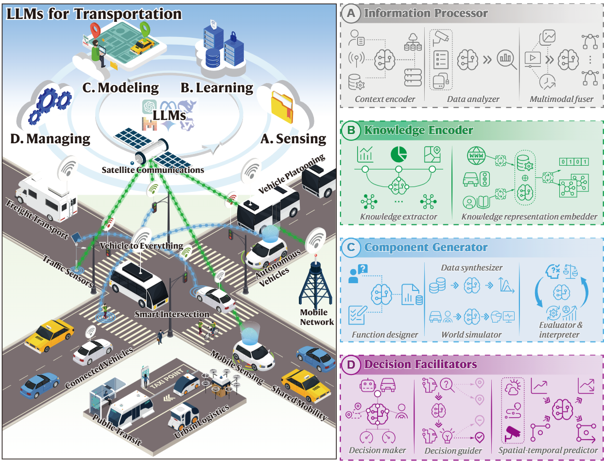
  
  *TL;DR*: We introduce the first systematic survey of LLMs in transportation systems from a methodological perspective.

***LLM-attacker: Enhancing Closed-loop Adversarial Scenario Generation for Autonomous Driving with Large Language Models***, Yuewen Mei, Tong Nie, Jian Sun\*, Ye Tian. *IEEE Transactions on Intelligent Transportation Systems*, 2025. | [[Paper](https://ieeexplore.ieee.org/abstract/document/11047235)] | [[Video](https://drive.google.com/file/d/1Zv4V3iG7825oyiKbUwS2Y-rR0DQIE1ZA/view)]

  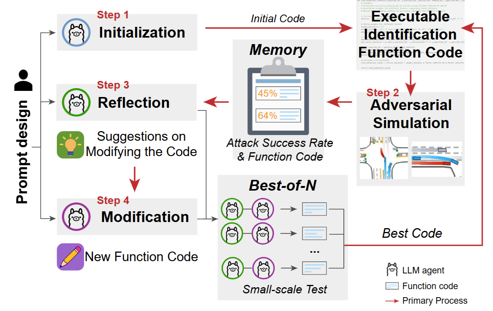
  
  *TL;DR*: We introduce an LLM-enhanced closed-loop adversarial scenario generation method for the testing of CAVs.

***Joint Estimation and Prediction of City-wide Delivery Demand: A Large Language Model Empowered Graph-based Learning Approach***, **Tong Nie**, Junlin He, Yuewen Mei, Guoyang Qin, Guilong Li, Jian Sun\*, Wei Ma\*. *Transportation Research Part E: Logistics and Transportation Review*, 2025. | [[Paper](https://doi.org/10.1016/j.tre.2025.104075)] | [[Code](https://github.com/tongnie/IMPEL)]

  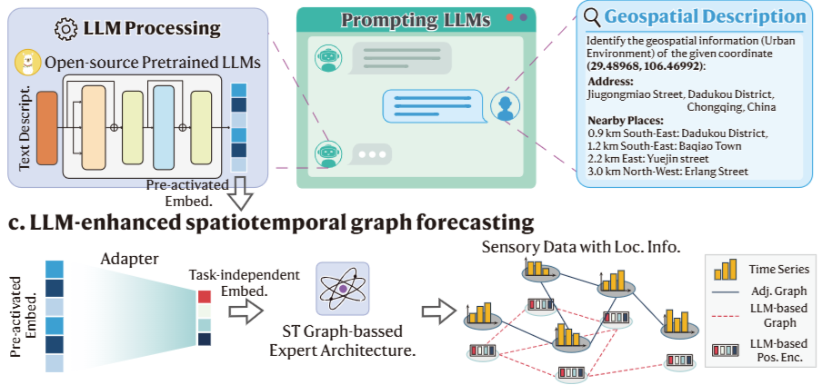
  
  *TL;DR*: A transferable traffic demand predictor and estimator enhanced by LLM-based encoding and graphs.

***Contextualizing MLP-Mixers Spatiotemporally for Urban Traffic Data Forecast at Scale***, **Tong Nie(=)**, Guoyang Qin(=), Lijun Sun, Wei Ma, Yu Mei, Jian Sun\*. *IEEE Transactions on Intelligent Transportation Systems*, 2025. | [[Paper](https://doi.org/10.1109/TITS.2024.3491754)] | 

  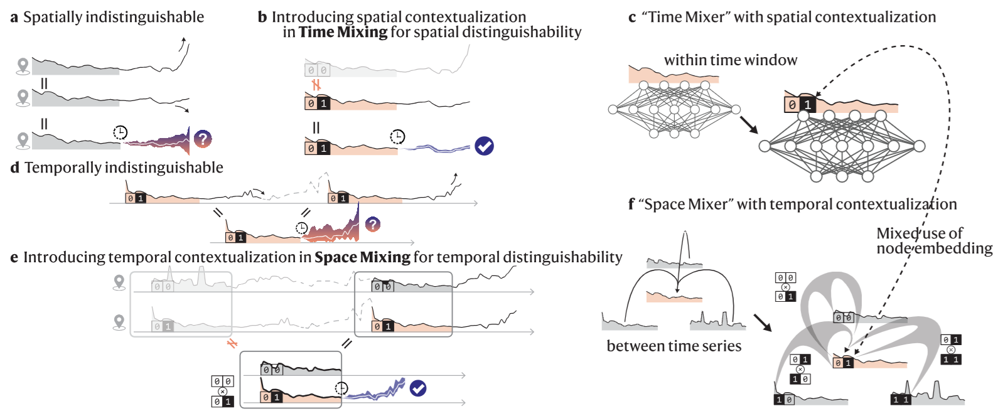
  
  *TL;DR*: A simple-yet-effective MLP-based architecture for large-scale urban data forecasting.

***Spatiotemporal Implicit Neural Representation as a Generalized Traffic Data Learner***, **Tong Nie**, Guoyang Qin, Wei Ma\*, Jian Sun\*. *Transportation Research Part C: Emerging Technologies*, 2024. | [[Paper](https://doi.org/10.1016/j.trc.2024.104890)] | [[Code](https://github.com/tongnie/traffic_dynamics)]

  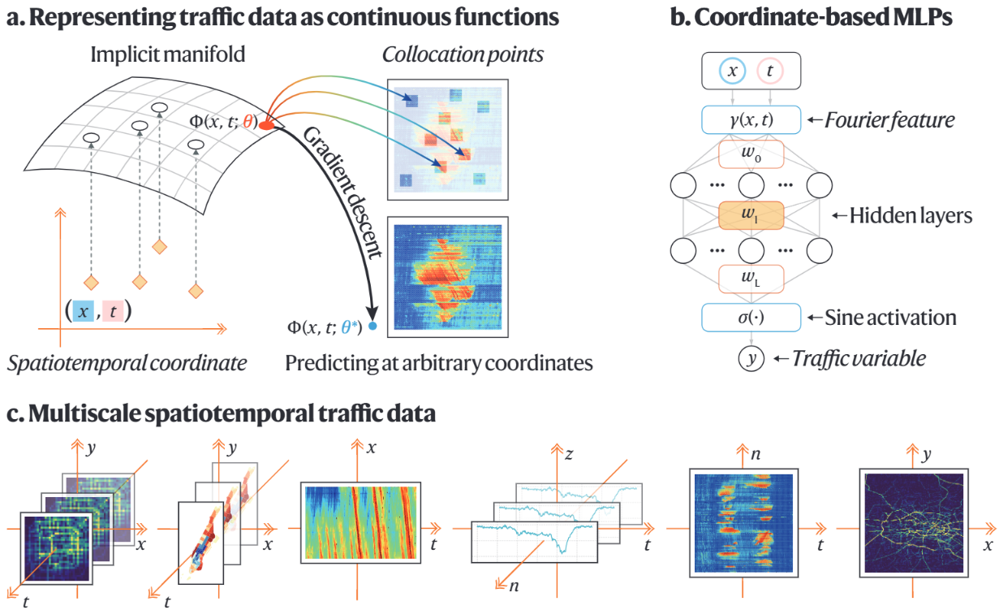
  
  *TL;DR*: A new paradigm for spatiotemporal traffic data learning using implicit neural representations.

***Towards better traffic volume estimation: Jointly addressing the underdetermination and nonequilibrium problems with correlation-adaptive GNNs***, **Tong Nie**, Guoyang Qin, Yunpeng Wang, Jian Sun\*. *Transportation Research Part C: Emerging Technologies*, 2023. | [[Paper](https://doi.org/10.1016/j.trc.2023.104402)] | [[Code](https://github.com/tongnie/GNN4Flow)]

  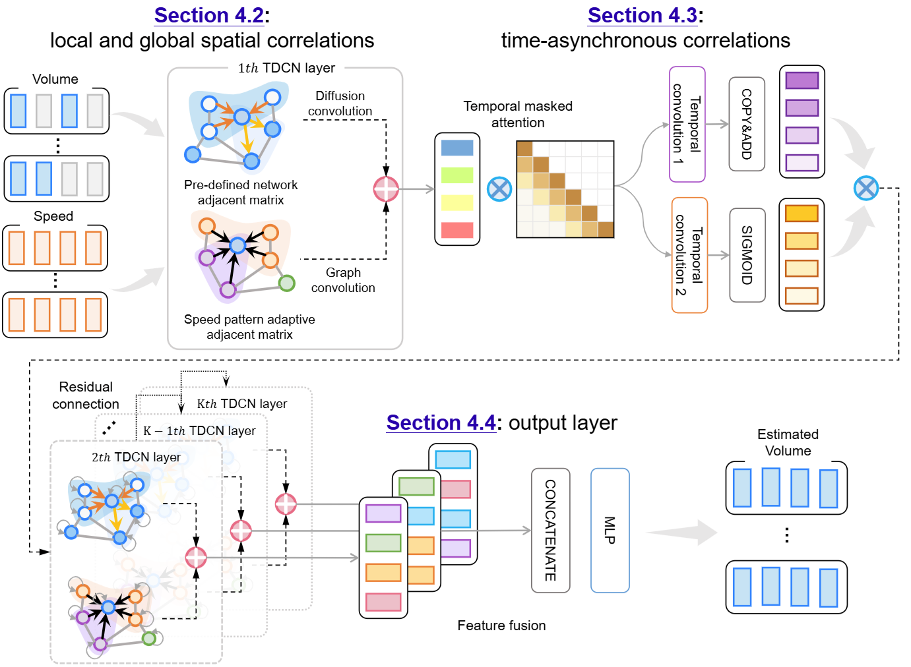
  
  *TL;DR*: A graph neural network model for unobserved traffic flow estimation considering speed-volume relationship.

***Correlating sparse sensing for large-scale traffic speed estimation: A Laplacian-enhanced low-rank tensor kriging approach***, **Tong Nie**, Guoyang Qin, Yunpeng Wang, Jian Sun\*. *Transportation Research Part C: Emerging Technologies*, 2023. | [[Paper](https://doi.org/10.1016/j.trc.2023.104190)] | [[Code](https://github.com/tongnie/tensor4kriging)]

  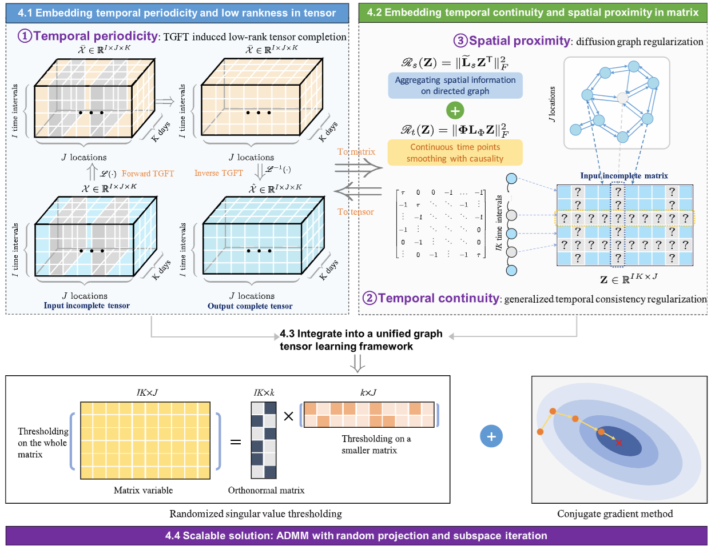
  
  *TL;DR*: A Laplacian regularized tensor completion model for unobserved traffic speed estimation on large-scale highway networks.

***Truncated tensor Schatten p-norm based approach for spatiotemporal traffic data imputation with complicated missing patterns***, **Tong Nie**, Guoyang Qin, Jian Sun\*. *Transportation Research Part C: Emerging Technologies*, 2022. | [[Paper](https://doi.org/10.1016/j.trc.2022.103737)] | [[Code](https://github.com/tongnie/tensorlib)]

  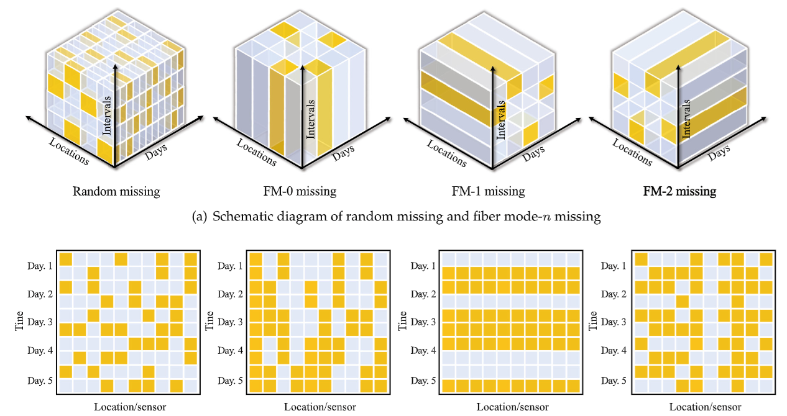
  
  *TL;DR*: A tensor completion model optimized by ADMM for sparse traffic data imputation.

## CS/AI Conference Proceedings

***Geolocation Representation from Large Language Models are Generic Enhancers for Spatio-Temporal Learning***, Junlin He(=), **Tong Nie(=)**, Wei Ma\*. *AAAI*, 2025. | [[Paper](https://doi.org/10.48550/arXiv.2408.12116)] | [[Code](https://github.com/Umaruchain/LLMGeovec)]

  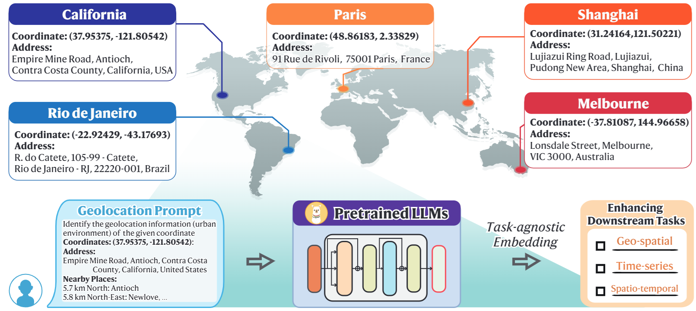
  
  *TL;DR*: A training-free method to extract generic geospatial encoding from LLMs that can enhance various downstream predictive learning tasks.

***Channel-Aware Low-Rank Adaptation in Time Series Forecasting***, **Tong Nie**, Yuewen Mei, Guoyang Qin, Jian Sun, Wei Ma\*. *CIKM*, 2024. | [[Paper](https://doi.org/10.1145/3627673.3679884)] | [[Code](https://github.com/tongnie/C-LoRA)]

  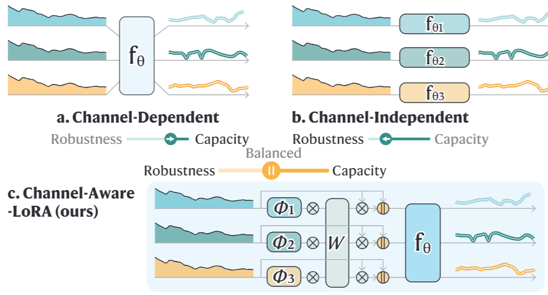
  
  *TL;DR*: A channel-aware low-rank adaptation method to balance channel independence and channel dependence.

***ImputeFormer: Low Rankness-Induced Transformers for Generalizable Spatiotemporal Imputation***, **Tong Nie**, Guoyang Qin, Wei Ma, Yuewen Mei, Jian Sun\*. *KDD*, 2024. | [[Paper](https://doi.org/10.1145/3637528.3671751)] | [[Code](https://github.com/tongnie/ImputeFormer)]

  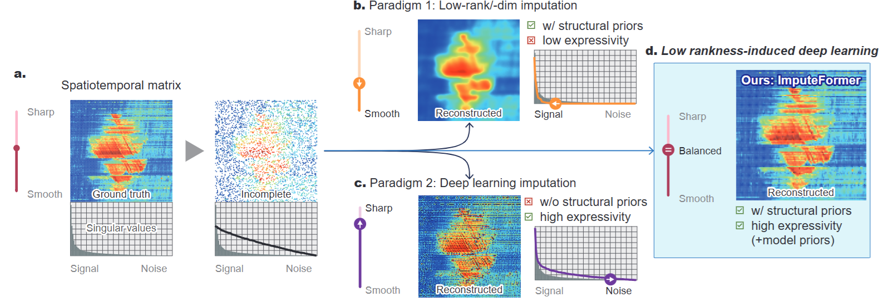
  
  *TL;DR*: A generalizable Transformer model for spatiotemporal data imputation, achieving SOTA performances and great efficiency.

***Seeking to Collide: Online Safety-Critical Scenario Generation for Autonomous Driving with Retrieval Augmented Large Language Models***, Yuewen Mei, **Tong Nie\***, Jian Sun, Ye Tian. *IEEE ITSC*, 2025. | [[Paper](https://doi.org/10.48550/arXiv.2505.00972)] | 

  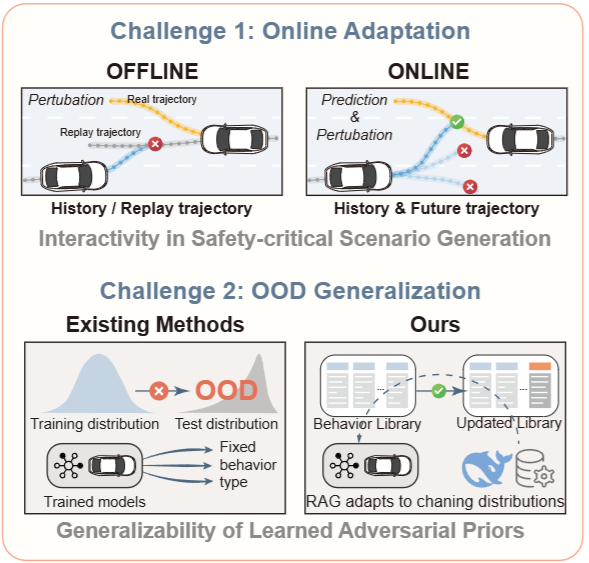
  
  *TL;DR*: We introduce an online safety-critical scenario generation method for autonomous driving using retrieval-augmented LLMs.
