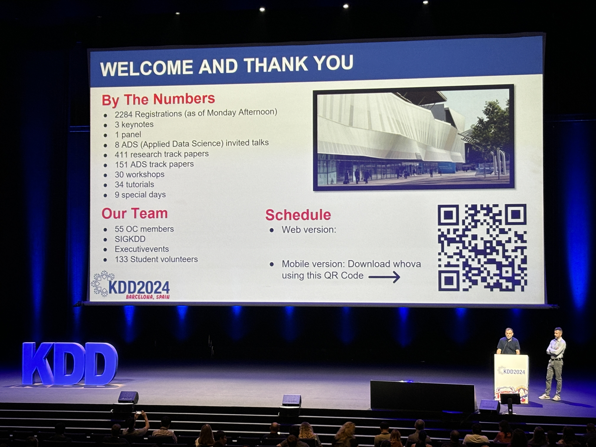
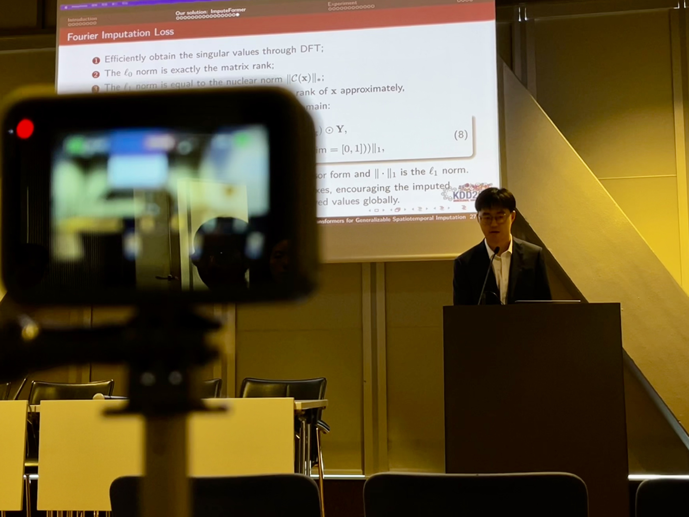

---
## Stochastic Modeling and Simulations of Car-Following Behaviors
_Feb. 2025, online_ \
Invited talk @ Massachusetts 

## Low-rankness Induced Transformers for Generalizable Spatiotemporal Imputation
_Aug. 25-29 2024, CCIB, Barcelona, Spain_ \
Conference Podium Presentation @ The 30th ACM SIGKDD Conference on Knowledge Discovery and Data Mining (KDD'24)

  
  

