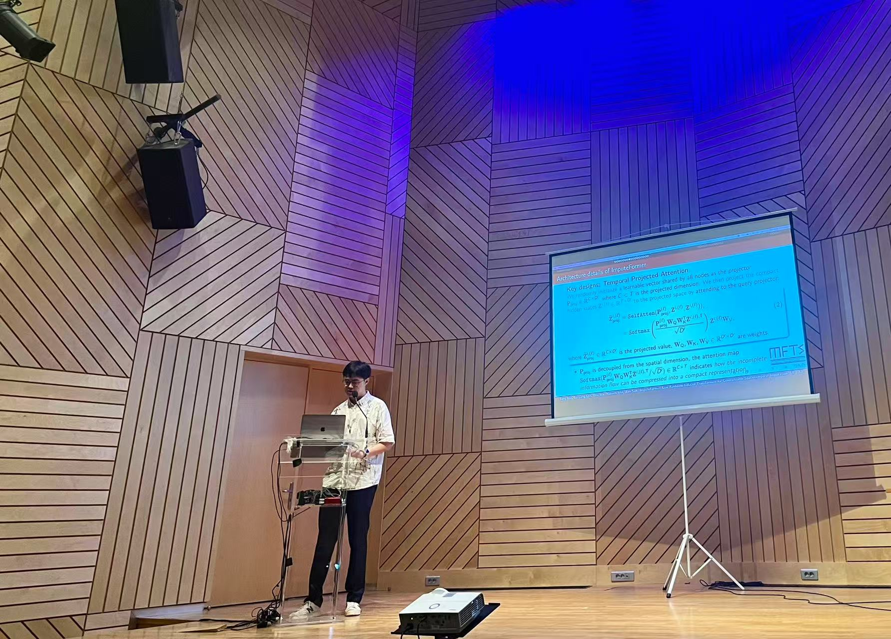

---
## Generalizable Implicit Neural Representations as a Universal Traffic Data Learner
_Sep. 2-4, 2024, Cultural Conference Center of Heraklion in Crete, Greece_ \
Conference Podium Presentation @ The Conference in Emerging Technologies in Transportation Systems (TRC-30). [[Paper]](https://doi.org/10.48550/arXiv.2406.08743)

  

## Low-rankness Induced Transformers for Generalizable Spatiotemporal Imputation
_Aug. 25-29 2024, CCIB, Barcelona, Spain_ \
Conference Podium Presentation @ The 30th ACM SIGKDD Conference on Knowledge Discovery and Data Mining (KDD'24). [[Video]](https://www.youtube.com/watch?v=_NVDAOm3BV0)

  
  

